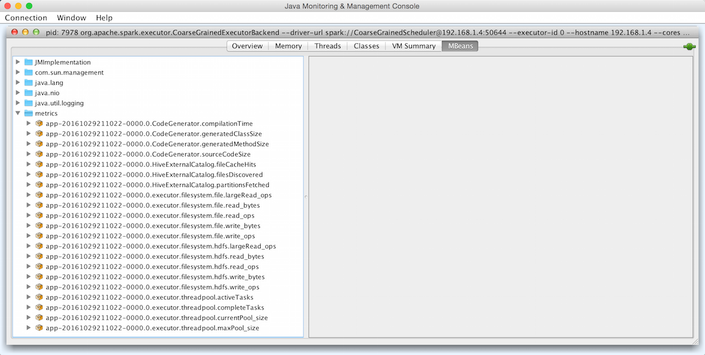

# ExecutorSource

`ExecutorSource` is a [Source](../metrics/Source.md) of [Executor](Executor.md#executorSource)s.



## Creating Instance

`ExecutorSource` takes the following to be created:

* <span id="threadPool"> [ThreadPoolExecutor](Executor.md#threadPool)
* <span id="executorId"> [Executor ID](Executor.md#executorId) (_unused_)
* <span id="fileSystemSchemes"> File System Schemes (to report based on [spark.executor.metrics.fileSystemSchemes](../configuration-properties.md#spark.executor.metrics.fileSystemSchemes))

`ExecutorSource` is created when:

* `Executor` is [created](Executor.md#executorSource)

## <span id="sourceName"> Name

`ExecutorSource` is known under the name **executor**.

## <span id="metricRegistry"> Metrics

```scala
metricRegistry: MetricRegistry
```

`metricRegistry` is part of the [Source](../metrics/Source.md#metricRegistry) abstraction.

Name | Description
-----|----------
 threadpool.activeTasks | Approximate number of threads that are actively executing tasks (based on [ThreadPoolExecutor.getActiveCount]({{ java.api }}/java.base/java/util/concurrent/ThreadPoolExecutor.html))
 _others_ |
