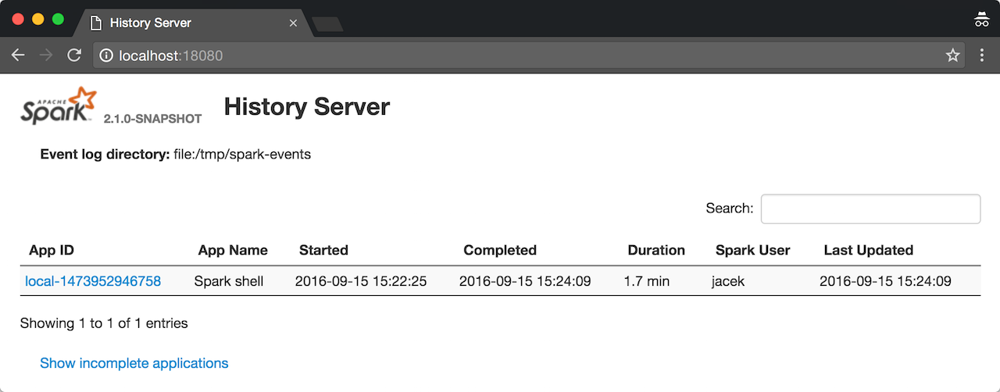

# Spark History Server

**Spark History Server** is the web UI of Spark applications with event log collection enabled (based on [spark.eventLog.enabled](configuration-properties.md#spark.eventLog.enabled) configuration property).



Spark History Server is an extension of Spark's [web UI](../webui/index.md).

Spark History Server can be started using [start-history-server.sh](#start_history_server_sh) and stopped using [stop-history-server.sh](#stop_history_server_sh) shell scripts.

Spark History Server supports custom [configuration properties](configuration-properties.md) that can be defined using `--properties-file [propertiesFile]` command-line option. The properties file can have any valid ``spark.``-prefixed Spark property.

```text
$ ./sbin/start-history-server.sh --properties-file history.properties
```

If not specified explicitly, Spark History Server uses the default configuration file, i.e. [spark-defaults.conf](../spark-properties.md#spark-defaults-conf).

Spark History Server can replay events from event log files recorded by [EventLoggingListener](EventLoggingListener.md).

## <span id="start_history_server_sh"> start-history-server.sh Shell Script

`$SPARK_HOME/sbin/start-history-server.sh` shell script (where `SPARK_HOME` is the directory of your Spark installation) is used to start a Spark History Server instance.

```text
$ ./sbin/start-history-server.sh
starting org.apache.spark.deploy.history.HistoryServer, logging to .../spark/logs/spark-jacek-org.apache.spark.deploy.history.HistoryServer-1-japila.out
```

Internally, `start-history-server.sh` script starts [org.apache.spark.deploy.history.HistoryServer](HistoryServer.md) standalone application (using `spark-daemon.sh` shell script).

```text
$ ./bin/spark-class org.apache.spark.deploy.history.HistoryServer
```

!!! tip
    Using the more explicit approach with `spark-class` to start Spark History Server could be easier to trace execution by seeing the logs printed out to the standard output and hence terminal directly.

When started, `start-history-server.sh` prints out the following INFO message to the logs:

```text
Started daemon with process name: [processName]
```

`start-history-server.sh` registers signal handlers (using `SignalUtils`) for `TERM`, `HUP`, `INT` to log their execution:

```text
RECEIVED SIGNAL [signal]
```

`start-history-server.sh` inits security if enabled (based on [spark.history.kerberos.enabled](configuration-properties.md#spark.history.kerberos.enabled) configuration property).

`start-history-server.sh` creates a `SecurityManager`.

`start-history-server.sh` creates a [ApplicationHistoryProvider](ApplicationHistoryProvider.md) (based on [spark.history.provider](configuration-properties.md#spark.history.provider) configuration property).

In the end, `start-history-server.sh` creates a [HistoryServer](HistoryServer.md) and requests it to bind to the port (based on [spark.history.ui.port](configuration-properties.md#spark.history.ui.port) configuration property).

!!! note
    The host's IP can be specified using `SPARK_LOCAL_IP` environment variable (defaults to `0.0.0.0`).

`start-history-server.sh` prints out the following INFO message to the logs:

```text
Bound HistoryServer to [host], and started at [webUrl]
```

`start-history-server.sh` registers a shutdown hook to call `stop` on the `HistoryServer` instance.

## <span id="stop_history_server_sh"> stop-history-server.sh Shell Script

`$SPARK_HOME/sbin/stop-history-server.sh` shell script (where `SPARK_HOME` is the directory of your Spark installation) is used to stop a running instance of Spark History Server.

```text
$ ./sbin/stop-history-server.sh
stopping org.apache.spark.deploy.history.HistoryServer
```
