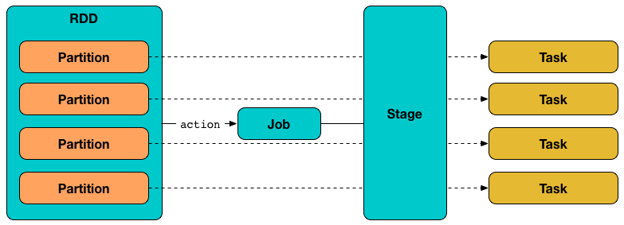

# Task

`Task` is an [abstraction](#contract) of the smallest individual [units of execution](#implementations) that can be [executed](#run) (to compute an RDD partition).



## Contract

### <span id="runTask"> Running Task

```scala
runTask(
  context: TaskContext): T
```

Runs the task (in a [TaskContext](TaskContext.md))

Used when `Task` is requested to [run](#run)

## Implementations

* [ResultTask](ResultTask.md)
* [ShuffleMapTask](ShuffleMapTask.md)

## Creating Instance

`Task` takes the following to be created:

* <span id="stageId"> [Stage](Stage.md) ID
* <span id="stageAttemptId"> Stage (execution) Attempt ID
* <span id="partitionId"> [Partition](../rdd/Partition.md) ID to compute
* <span id="localProperties"> [Local Properties](../SparkContext.md#localProperties)
* <span id="serializedTaskMetrics"> Serialized [TaskMetrics](../executor/TaskMetrics.md) (`Array[Byte]`)
* <span id="jobId"> [ActiveJob](ActiveJob.md) ID (default: `None`)
* <span id="appId"> Application ID (default: `None`)
* <span id="appAttemptId"> Application Attempt ID (default: `None`)
* <span id="isBarrier"> `isBarrier` flag (default: `false`)

`Task` is created when:

* `DAGScheduler` is requested to [submit missing tasks of a stage](DAGScheduler.md#submitMissingTasks)

??? note "Abstract Class"
    `Task` is an abstract class and cannot be created directly. It is created indirectly for the [concrete Tasks](#implementations).

## <span id="taskMemoryManager"><span id="setTaskMemoryManager"> TaskMemoryManager

`Task` is given a [TaskMemoryManager](../memory/TaskMemoryManager.md) when `TaskRunner` is requested to [run a task](../executor/TaskRunner.md#run) (right after deserializing the task for [execution](#run)).

`Task` uses the `TaskMemoryManager` to create a [TaskContextImpl](TaskContextImpl.md) (when requested to [run](#run)).

## <span id="Serializable"> Serializable

`Task` is a `Serializable` ([Java]({{ java.api }}/java.base/java/io/Serializable.html)) so it can be serialized (to bytes) and send over the wire for execution from the driver to executors.

## <span id="preferredLocations"> Preferred Locations

```scala
preferredLocations: Seq[TaskLocation]
```

[TaskLocations](TaskLocation.md) that represent preferred locations (executors) to execute the task on.

Empty by default and so no task location preferences are defined that says the task could be launched on any executor.

!!! note
    Defined by the [concrete tasks](#implementations) (i.e. [ShuffleMapTask](ShuffleMapTask.md#preferredLocations) and [ResultTask](ResultTask.md#preferredLocations)).

`preferredLocations` is used when `TaskSetManager` is requested to [register a task as pending execution](TaskSetManager.md#addPendingTask) and [dequeueSpeculativeTask](TaskSetManager.md#dequeueSpeculativeTask).

## <span id="run"> Running Task Thread

```scala
run(
  taskAttemptId: Long,
  attemptNumber: Int,
  metricsSystem: MetricsSystem): T
```

`run` [registers the task (identified as `taskAttemptId`) with the local `BlockManager`](../storage/BlockManager.md#registerTask).

!!! note
    `run` uses `SparkEnv` to access the current [BlockManager](../SparkEnv.md#blockManager).

`run` creates a [TaskContextImpl](TaskContextImpl.md) that in turn becomes the task's [TaskContext](TaskContext.md#setTaskContext).

!!! note
    `run` is a `final` method and so must not be overriden.

`run` checks [_killed](#_killed) flag and, if enabled, [kills the task](#kill) (with `interruptThread` flag disabled).

`run` creates a Hadoop `CallerContext` and sets it.

`run` [runs the task](#runTask).

!!! note
    This is the moment when the custom `Task`'s [runTask](#runTask) is executed.

In the end, `run` [notifies `TaskContextImpl` that the task has completed](TaskContextImpl.md#markTaskCompleted) (regardless of the final outcome -- a success or a failure).

In case of any exceptions, `run` [notifies `TaskContextImpl` that the task has failed](TaskContextImpl.md#markTaskFailed). `run` [requests `MemoryStore` to release unroll memory for this task](../storage/MemoryStore.md#releaseUnrollMemoryForThisTask) (for both `ON_HEAP` and `OFF_HEAP` memory modes).

!!! note
    `run` uses `SparkEnv` to access the current [BlockManager](../SparkEnv.md#blockManager) that it uses to access [MemoryStore](../storage/BlockManager.md#memoryStore).

`run` [requests `MemoryManager` to notify any tasks waiting for execution memory to be freed to wake up and try to acquire memory again](../memory/MemoryManager.md).

`run` [unsets the task's `TaskContext`](TaskContext.md#unset).

!!! note
    `run` uses `SparkEnv` to access the current [MemoryManager](../SparkEnv.md#memoryManager).

`run` is used when `TaskRunner` is requested to [run](../executor/TaskRunner.md#run) (when `Executor` is requested to [launch a task (on "Executor task launch worker" thread pool sometime in the future)](../executor/Executor.md#launchTask)).

## <span id="states"><span id="TaskState"> Task States

`Task` can be in one of the following states (as described by `TaskState` enumeration):

* `LAUNCHING`
* `RUNNING` when the task is being started.
* `FINISHED` when the task finished with the serialized result.
* `FAILED` when the task fails, e.g. when [FetchFailedException](../shuffle/FetchFailedException.md), `CommitDeniedException` or any `Throwable` occurs
* `KILLED` when an executor kills a task.
* `LOST`

States are the values of `org.apache.spark.TaskState`.

!!! note
    Task status updates are sent from executors to the driver through [ExecutorBackend](../executor/ExecutorBackend.md).

Task is finished when it is in one of `FINISHED`, `FAILED`, `KILLED`, `LOST`.

`LOST` and `FAILED` states are considered failures.

## <span id="collectAccumulatorUpdates"> Collecting Latest Values of Accumulators

```scala
collectAccumulatorUpdates(
  taskFailed: Boolean = false): Seq[AccumulableInfo]
```

`collectAccumulatorUpdates` collects the latest values of internal and external accumulators from a task (and returns the values as a collection of [AccumulableInfo](../accumulators/AccumulableInfo.md)).

Internally, `collectAccumulatorUpdates` [takes `TaskMetrics`](TaskContextImpl.md#taskMetrics).

!!! note
    `collectAccumulatorUpdates` uses [TaskContextImpl](#context) to access the task's `TaskMetrics`.

`collectAccumulatorUpdates` collects the latest values of:

* [internal accumulators](../executor/TaskMetrics.md#internalAccums) whose current value is not the zero value and the `RESULT_SIZE` accumulator (regardless whether the value is its zero or not).

* [external accumulators](../executor/TaskMetrics.md#externalAccums) when `taskFailed` is disabled (`false`) or which [should be included on failures](../accumulators/index.md#countFailedValues).

`collectAccumulatorUpdates` returns an empty collection when [TaskContextImpl](#context) is not initialized.

`collectAccumulatorUpdates` is used when [`TaskRunner` runs a task](../executor/TaskRunner.md#run) (and sends a task's final results back to the driver).

## <span id="kill"> Killing Task

```scala
kill(
  interruptThread: Boolean): Unit
```

`kill` marks the task to be killed, i.e. it sets the internal `_killed` flag to `true`.

`kill` calls [TaskContextImpl.markInterrupted](TaskContextImpl.md#markInterrupted) when `context` is set.

If `interruptThread` is enabled and the internal `taskThread` is available, `kill` interrupts it.

CAUTION: FIXME When could `context` and `interruptThread` not be set?
