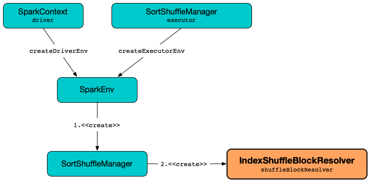
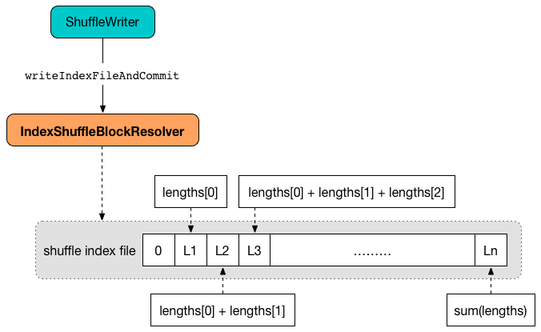

# IndexShuffleBlockResolver

`IndexShuffleBlockResolver` is a [ShuffleBlockResolver](ShuffleBlockResolver.md) that manages shuffle block data and uses **shuffle index files** for faster shuffle data access.

## Creating Instance

`IndexShuffleBlockResolver` takes the following to be created:

* <span id="conf"> [SparkConf](../SparkConf.md)
* <span id="_blockManager"><span id="blockManager"> [BlockManager](../storage/BlockManager.md)

`IndexShuffleBlockResolver` is created when:

* `SortShuffleManager` is [created](SortShuffleManager.md#shuffleBlockResolver)
* `LocalDiskShuffleExecutorComponents` is requested to [initializeExecutor](LocalDiskShuffleExecutorComponents.md#initializeExecutor)



## <span id="getStoredShuffles"> getStoredShuffles

```scala
getStoredShuffles(): Seq[ShuffleBlockInfo]
```

`getStoredShuffles` is part of the [MigratableResolver](MigratableResolver.md#getStoredShuffles) abstraction.

`getStoredShuffles`...FIXME

## <span id="putShuffleBlockAsStream"> putShuffleBlockAsStream

```scala
putShuffleBlockAsStream(
  blockId: BlockId,
  serializerManager: SerializerManager): StreamCallbackWithID
```

`putShuffleBlockAsStream` is part of the [MigratableResolver](MigratableResolver.md#putShuffleBlockAsStream) abstraction.

`putShuffleBlockAsStream`...FIXME

## <span id="getMigrationBlocks"> getMigrationBlocks

```scala
getMigrationBlocks(
  shuffleBlockInfo: ShuffleBlockInfo): List[(BlockId, ManagedBuffer)]
```

`getMigrationBlocks` is part of the [MigratableResolver](MigratableResolver.md#getMigrationBlocks) abstraction.

`getMigrationBlocks`...FIXME

## <span id="writeIndexFileAndCommit"> Writing Shuffle Index and Data Files

```scala
writeIndexFileAndCommit(
  shuffleId: Int,
  mapId: Long,
  lengths: Array[Long],
  dataTmp: File): Unit
```

`writeIndexFileAndCommit` finds the [index](#getIndexFile) and [data](#getDataFile) files for the input `shuffleId` and `mapId`.

`writeIndexFileAndCommit` creates a temporary file for the index file (in the same directory) and writes offsets (as the moving sum of the input `lengths` starting from 0 to the final offset at the end for the end of the output file).

!!! NOTE
    The offsets are the sizes in the input `lengths` exactly.



`writeIndexFileAndCommit`...FIXME (Review me)

`writeIndexFileAndCommit` <<getDataFile, requests a shuffle block data file>> for the input `shuffleId` and `mapId`.

`writeIndexFileAndCommit` <<checkIndexAndDataFile, checks if the given index and data files match each other>> (aka _consistency check_).

If the consistency check fails, it means that another attempt for the same task has already written the map outputs successfully and so the input `dataTmp` and temporary index files are deleted (as no longer correct).

If the consistency check succeeds, the existing index and data files are deleted (if they exist) and the temporary index and data files become "official", i.e. renamed to their final names.

In case of any IO-related exception, `writeIndexFileAndCommit` throws a `IOException` with the messages:

```text
fail to rename file [indexTmp] to [indexFile]
```

or

```text
fail to rename file [dataTmp] to [dataFile]
```

`writeIndexFileAndCommit` is used when:

* `LocalDiskShuffleMapOutputWriter` is requested to [commitAllPartitions](LocalDiskShuffleMapOutputWriter.md#commitAllPartitions)
* `LocalDiskSingleSpillMapOutputWriter` is requested to [transferMapSpillFile](LocalDiskSingleSpillMapOutputWriter.md#transferMapSpillFile)

## <span id="removeDataByMap"> Removing Shuffle Index and Data Files

```scala
removeDataByMap(
  shuffleId: Int,
  mapId: Long): Unit
```

`removeDataByMap` [finds](#getDataFile) and deletes the shuffle data file (for the input `shuffleId` and `mapId`) followed by [finding](#getIndexFile) and deleting the shuffle data index file.

`removeDataByMap` is used when:

* `SortShuffleManager` is requested to [unregister a shuffle](SortShuffleManager.md#unregisterShuffle) (and remove a shuffle from a shuffle system)

## <span id="getIndexFile"> Creating Shuffle Block Index File

```scala
getIndexFile(
  shuffleId: Int,
  mapId: Long,
  dirs: Option[Array[String]] = None): File
```

`getIndexFile` creates a [ShuffleIndexBlockId](../storage/BlockId.md#ShuffleIndexBlockId).

With `dirs` local directories defined, `getIndexFile` [places the index file](ExecutorDiskUtils.md#getFile) of the `ShuffleIndexBlockId` (by the name) in the local directories (with the [spark.diskStore.subDirectories](../configuration-properties.md#DISKSTORE_SUB_DIRECTORIES)).

Otherwise, with no local directories, `getIndexFile` requests the [DiskBlockManager](../storage/BlockManager.md#diskBlockManager) (of the [BlockManager](#blockManager)) to [get the data file](../storage/DiskBlockManager.md#getFile).

`getIndexFile` is used when:

* `IndexShuffleBlockResolver` is requested to [getBlockData](#getBlockData), [removeDataByMap](#removeDataByMap), [putShuffleBlockAsStream](#putShuffleBlockAsStream), [getMigrationBlocks](#getMigrationBlocks), [writeIndexFileAndCommit](#writeIndexFileAndCommit)
* `FallbackStorage` is requested to [copy](../storage/FallbackStorage.md#copy)

## <span id="getDataFile"> Creating Shuffle Block Data File

``` { .scala .annotate }
getDataFile(
  shuffleId: Int,
  mapId: Long): File // (1)
getDataFile(
  shuffleId: Int,
  mapId: Long,
  dirs: Option[Array[String]]): File
```

1. `dirs` is `None` (undefined)

`getDataFile` creates a [ShuffleDataBlockId](../storage/BlockId.md#ShuffleDataBlockId).

With `dirs` local directories defined, `getDataFile` [places the data file](ExecutorDiskUtils.md#getFile) of the `ShuffleDataBlockId` (by the name) in the local directories (with the [spark.diskStore.subDirectories](../configuration-properties.md#DISKSTORE_SUB_DIRECTORIES)).

Otherwise, with no local directories, `getDataFile` requests the [DiskBlockManager](../storage/BlockManager.md#diskBlockManager) (of the [BlockManager](#blockManager)) to [get the data file](../storage/DiskBlockManager.md#getFile).

`getDataFile` is used when:

* `IndexShuffleBlockResolver` is requested to [getBlockData](#getBlockData), [removeDataByMap](#removeDataByMap), [putShuffleBlockAsStream](#putShuffleBlockAsStream), [getMigrationBlocks](#getMigrationBlocks), [writeIndexFileAndCommit](#writeIndexFileAndCommit)
* `LocalDiskShuffleMapOutputWriter` is [created](LocalDiskShuffleMapOutputWriter.md#outputFile)
* `LocalDiskSingleSpillMapOutputWriter` is requested to [transferMapSpillFile](LocalDiskSingleSpillMapOutputWriter.md#transferMapSpillFile)
* `FallbackStorage` is requested to [copy](../storage/FallbackStorage.md#copy)

## <span id="getBlockData"> Creating ManagedBuffer to Read Shuffle Block Data File

```scala
getBlockData(
  blockId: BlockId,
  dirs: Option[Array[String]]): ManagedBuffer
```

`getBlockData` is part of the [ShuffleBlockResolver](ShuffleBlockResolver.md#getBlockData) abstraction.

`getBlockData`...FIXME

## <span id="checkIndexAndDataFile"> Checking Consistency of Shuffle Index and Data Files

```scala
checkIndexAndDataFile(
  index: File,
  data: File,
  blocks: Int): Array[Long]
```

!!! danger
    Review Me

`checkIndexAndDataFile` first checks if the size of the input `index` file is exactly the input `blocks` multiplied by `8`.

`checkIndexAndDataFile` returns `null` when the numbers, and hence the shuffle index and data files, don't match.

`checkIndexAndDataFile` reads the shuffle `index` file and converts the offsets into lengths of each block.

`checkIndexAndDataFile` makes sure that the size of the input shuffle `data` file is exactly the sum of the block lengths.

`checkIndexAndDataFile` returns the block lengths if the numbers match, and `null` otherwise.

## <span id="transportConf"> TransportConf

`IndexShuffleBlockResolver` [creates a TransportConf](../network/SparkTransportConf.md#fromSparkConf) (for **shuffle** module) when [created](#creating-instance).

`transportConf` is used in [getMigrationBlocks](#getMigrationBlocks) and [getBlockData](#getBlockData).

## Logging

Enable `ALL` logging level for `org.apache.spark.shuffle.IndexShuffleBlockResolver` logger to see what happens inside.

Add the following line to `conf/log4j.properties`:

```text
log4j.logger.org.apache.spark.shuffle.IndexShuffleBlockResolver=ALL
```

Refer to [Logging](../spark-logging.md).
